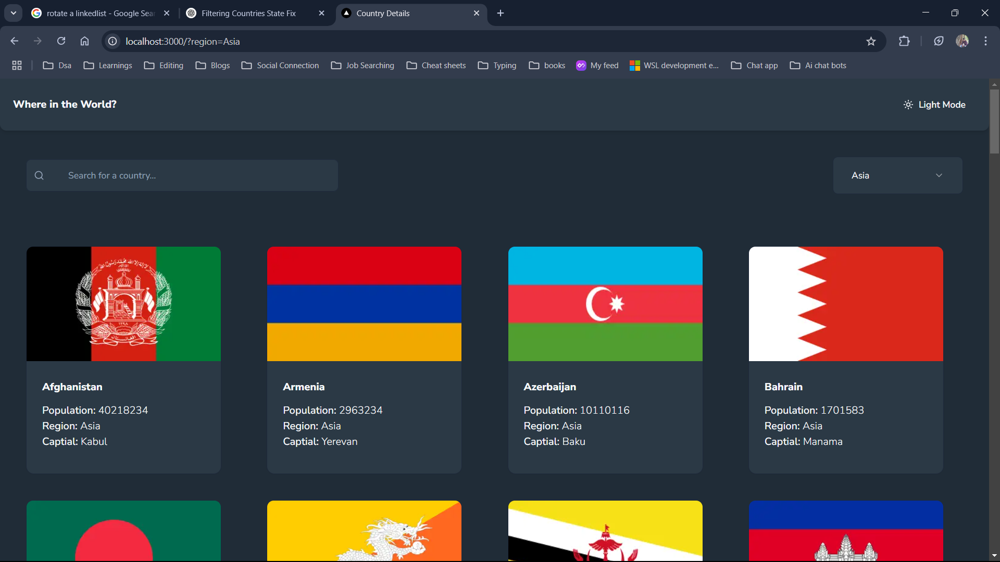

# Frontend Mentor - QR code component solution

This is a solution to the [REST Countries API challenge on Frontend Mentor](https://www.frontendmentor.io/challenges/rest-countries-api-with-color-theme-switcher-5cacc469fec04111f7b848ca). 
Frontend Mentor have numerous challenges to help improve coding skills by building realistic projects. 

## Table of contents

- [Overview](#overview)
  - [Screenshot](#screenshot)
  - [Links](#links)
  - [Built with](#built-with)
- [Author](#author)
- [Acknowledgments](#acknowledgments)

## Overview
  ### It is Country Details App. Used to give details of all the countries.
### Screenshot

### Links

- GitHub URL: [Code](https://github.com/sridhar-geek/country-details)
- Site URL: [Demo](https://sridhar-geek.github.io/QR_code/)

### Built with

- Next.js
- TypeScript
- Tailwind CSS
- Rest Api
- Shadcn

## Author

- Frontend Mentor - [@sridhar-geek](https://www.frontendmentor.io/profile/sridhar-geek)

## Acknowledgments

